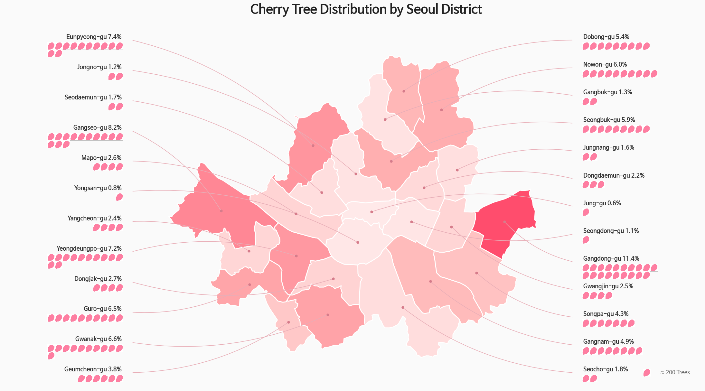
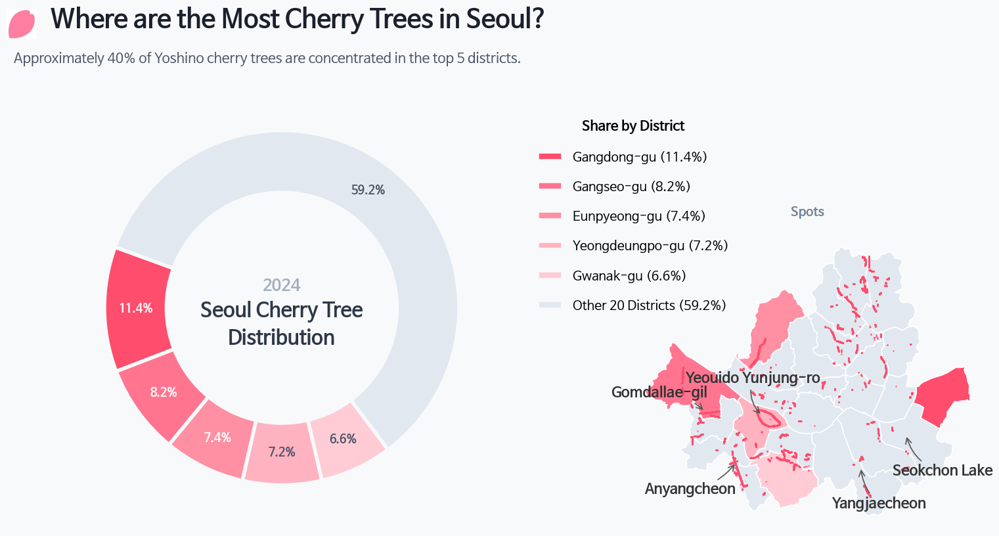

Spring is here, and cherry blossoms are about to bloom across Seoul.

Every year around this time, people flock to cherry blossom spots all over the city. That got me curious: where exactly are Seoul's cherry blossom trees, and how many are there?

Let's grab some data and find out through exploratory analysis.

We'll start with roadside tree location data from [**Seoul Open Data**](https://data.seoul.go.kr/dataList/OA-320/S/1/datasetView.do). It appears to be from 2023, which is a bit dated, but let's work with what we have.

```python
import pandas as pd
df = pd.read_csv("seoul_roadside_trees.csv", low_memory=False)
```


## Total Tree Count by Species

```python
tree_counts_series = df["TREE_NM"].value_counts()
tree_freq_series = tree_counts_series / tree_counts_series.sum()
tree_freq_series.name = "freq"
pd.concat([tree_counts_series, tree_freq_series], axis=1).head(10)
```

```
count	freq
TREE_NM		
은행나무	109331	0.425024
양버즘나무	68753	0.267277
느티나무	22928	0.089133
버즘나무	17407	0.067670
벚나무	7195	0.027971
왕벚나무	6623	0.025747
메타세쿼이아	5289	0.020561
회화나무	4655	0.018096
소나무	2740	0.010652
이팝나무	2647	0.010290

```

Ginkgo trees dominate at 42.5%, as expected. Cherry blossom trees (벚나무) and Yoshino cherry trees (왕벚나무) account for 2.7% and 2.5% respectively.

Let's zoom in on just the cherry blossom varieties.

```python
cb_df = df[df["TREE_NM"].isin(["벚나무", "왕벚나무"])]
cb_df["GU_NM"].value_counts().head()
```

```
GU_NM
영등포구    1803
도봉구     1700
관악구     1335
강서구      964
금천구      933
Name: count, dtype: int64
```

Yeongdeungpo-gu tops the list -- that makes sense, given the famous Yeouido cherry blossom road. Gangseo-gu and Geumcheon-gu also crack the top 5, which I hadn't expected.

How about we plot these on a map?

<details>
<summary>Show code</summary>


```python
import geopandas as gpd
import matplotlib.pyplot as plt
import matplotlib as mpl
import matplotlib.font_manager as fm
import contextily as ctx
from shapely.geometry import Point

# Font setup for Korean labels
fm._load_fontmanager(try_read_cache=False)
mpl.rcParams["font.family"] = "NanumBarunGothic"
mpl.rcParams["axes.unicode_minus"] = False

# Create GeoDataFrame
gdf = gpd.GeoDataFrame(
    cb_df,
    geometry=[Point(float(x), float(y)) for x, y in zip(cb_df["LOT"], cb_df["LAT"])],
    crs="EPSG:4326",
)

# Convert to Web Mercator for basemap
gdf = gdf.to_crs(epsg=3857)

# Assign colors by district
districts = sorted(gdf["GU_NM"].unique())
cmap = plt.cm.get_cmap("tab20", len(districts))
color_map = {gu: cmap(i) for i, gu in enumerate(districts)}

fig, ax = plt.subplots(figsize=(12, 12))

for gu in districts:
    sub = gdf[gdf["GU_NM"] == gu]
    ax.scatter(
        sub.geometry.x, sub.geometry.y,
        c=[color_map[gu]], label=gu,
        s=5, alpha=0.6, edgecolors="none",
    )

# Add basemap
ctx.add_basemap(ax, source=ctx.providers.CartoDB.Positron)

ax.set_title("서울시 벚나무·왕벚나무 위치 (구별)", fontsize=16)
ax.legend(
    loc="upper left", bbox_to_anchor=(1.01, 1),
    markerscale=3, fontsize=8, title="구",
)
ax.set_axis_off()
plt.tight_layout()
plt.show()
```

</details>


- Yeouido stands out clearly.
- The Gomdallae-gil path in Gangseo-gu is also distinctly visible.
- Geumcheon-gu lives up to its reputation for cherry blossoms.

However, some well-known cherry blossom spots like Anyangcheon Stream and Seokchon Lake don't show up here. After some digging, I found a separate dataset on [**Seoul Open Data**](https://data.seoul.go.kr/dataList/367/S/2/datasetView.do) that provides district-level aggregated counts -- but without coordinates, unfortunately.

I downloaded it as `roadside_tree_2026.csv`.


<details>
<summary>Show code</summary>

```python
df2 = pd.read_csv("roadside_tree_2026.csv", low_memory=False)

species_row = df2.iloc[1].values  # species name row
cols = df2.columns.tolist()

# Map start column index for each year
year_starts = {}
for i, c in enumerate(cols):
    base = c.split(".")[0]
    if base not in year_starts and base not in ["자치구별(1)", "자치구별(2)"]:
        year_starts[base] = i
years = list(year_starts.keys())

# Filter to actual district names (exclude subtotals)
districts = ["종로구", "중구", "용산구", "성동구", "광진구", "동대문구", "중랑구", "성북구",
             "강북구", "도봉구", "노원구", "은평구", "서대문구", "마포구", "양천구", "강서구",
             "구로구", "금천구", "영등포구", "동작구", "관악구", "서초구", "강남구", "송파구", "강동구"]
data_rows = df2[df2["자치구별(2)"].isin(districts)].copy()

# Extract cherry tree column per year → long format
records = []
for yi, y in enumerate(years):
    start = year_starts[y]
    cherry_col_idx = start + 5  # offset 5 within each year block = cherry/Yoshino cherry
    for _, row in data_rows.iterrows():
        val = row.iloc[cherry_col_idx]
        try:
            val = int(val)
        except (ValueError, TypeError):
            val = 0
        records.append({"year": int(y), "district": row["자치구별(2)"], "cherry_count": val})

cherry_df = pd.DataFrame(records)
cherry_df.head()
```

</details>

```
year	district	cherry_count
0	2004	종로구	145
1	2004	중구	58
2	2004	용산구	166
3	2004	성동구	429
4	2004	광진구	0
```

The data spans from 2004 to 2024. With multiple tree species tracked over time, this could make for a fun time-series visualization too.

Here's a quick choropleth to get a feel for the distribution:


<details>
<summary>Show code</summary>


```python
import geopandas as gpd
import matplotlib.pyplot as plt
import matplotlib as mpl
import matplotlib.font_manager as fm

# Font setup
fm._load_fontmanager(try_read_cache=False)
mpl.rcParams["font.family"] = "NanumBarunGothic"
mpl.rcParams["axes.unicode_minus"] = False

# Seoul district boundaries
seoul = gpd.read_file("seoul_gu.geojson")

# 2024 cherry tree counts
cherry_2024 = cherry_df[cherry_df["year"] == 2024][["district", "cherry_count"]].copy()

# Merge
seoul = seoul.merge(cherry_2024, left_on="name", right_on="district", how="left")
seoul["cherry_count"] = seoul["cherry_count"].fillna(0).astype(int)

fig, ax = plt.subplots(figsize=(10, 10))

seoul.plot(
    column="cherry_count", cmap="PuRd", edgecolor="white", linewidth=1.5,
    legend=True,
    legend_kwds={"label": "왕벚나무 수 (그루)", "shrink": 0.6},
    ax=ax,
)

# Label each district with name + count
for _, row in seoul.iterrows():
    centroid = row.geometry.centroid
    ax.annotate(
        f"{row['name']}\n{row['cherry_count']:,}",
        xy=(centroid.x, centroid.y),
        ha="center", va="center", fontsize=7, fontweight="bold",
    )

ax.set_title("2024년 서울시 자치구별 왕벚나무 수", fontsize=16)
ax.set_axis_off()
plt.tight_layout()
plt.show()
```

</details>


> Why does Gangdong-gu have so many?

Now, let's visualize what share each district holds of Seoul's total cherry tree population. Since cherry blossoms have such beautiful pink petals, let's use that as a visual motif. I asked `Gemini` to generate a simple flat pink petal icon.


Not bad at all. Let's combine this with the map and the district-level data to create an infographic. The idea is to sketch the composition by hand and leverage AI for the visual assets.

<details>
<summary>Show code</summary>

```python
import numpy as np
import geopandas as gpd
import matplotlib.pyplot as plt
import matplotlib as mpl
import matplotlib.font_manager as fm
import matplotlib.image as mpimg
from matplotlib.offsetbox import OffsetImage, AnnotationBbox
import matplotlib.colors as mcolors

# --- Font Settings ---
# Switching to a standard sans-serif font for English rendering
mpl.rcParams["font.family"] = "NanumBarunGothic"
mpl.rcParams["axes.unicode_minus"] = False

# === 1. Data Preparation ===
seoul_inf = gpd.read_file("seoul_gu.geojson")

# Filtering cherry tree data for 2024
# (Note: Assumes cherry_df is already loaded in your environment)
c2024 = cherry_df[cherry_df["year"] == 2024][["district", "cherry_count"]].copy()

seoul_inf = seoul_inf.merge(c2024, left_on="name", right_on="district", how="left")
seoul_inf["cherry_count"] = seoul_inf["cherry_count"].fillna(0).astype(int)

# --- 💡 NEW: Korean to English District Mapping ---
district_mapping = {
    '강남구': 'Gangnam-gu', '강동구': 'Gangdong-gu', '강북구': 'Gangbuk-gu',
    '강서구': 'Gangseo-gu', '관악구': 'Gwanak-gu', '광진구': 'Gwangjin-gu',
    '구로구': 'Guro-gu', '금천구': 'Geumcheon-gu', '노원구': 'Nowon-gu',
    '도봉구': 'Dobong-gu', '동대문구': 'Dongdaemun-gu', '동작구': 'Dongjak-gu',
    '마포구': 'Mapo-gu', '서대문구': 'Seodaemun-gu', '서초구': 'Seocho-gu',
    '성동구': 'Seongdong-gu', '성북구': 'Seongbuk-gu', '송파구': 'Songpa-gu',
    '양천구': 'Yangcheon-gu', '영등포구': 'Yeongdeungpo-gu', '용산구': 'Yongsan-gu',
    '은평구': 'Eunpyeong-gu', '종로구': 'Jongno-gu', '중구': 'Jung-gu',
    '중랑구': 'Jungnang-gu'
}
# Create a new column for English names
seoul_inf["name_eng"] = seoul_inf["name"].map(district_mapping)

# Calculate percentages and number of petals
total = seoul_inf["cherry_count"].sum()
seoul_inf["pct"] = seoul_inf["cherry_count"] / total * 100
seoul_inf["n_petals"] = np.maximum(1, seoul_inf["cherry_count"] // 200)

seoul_inf["cx"] = seoul_inf.geometry.centroid.x
seoul_inf["cy"] = seoul_inf.geometry.centroid.y
mcx = seoul_inf["cx"].mean()

# Split districts into Left/Right groups
left_mask = seoul_inf["cx"] < mcx
left_df = seoul_inf[left_mask].sort_values("cy", ascending=False).reset_index(drop=True)
right_df = seoul_inf[~left_mask].sort_values("cy", ascending=False).reset_index(drop=True)

# === 2. Cherry Blossom Petal Image Function ===
petal_img = mpimg.imread(
    "/home/jonghwan/git/jonghwanyoon.github.io/src/content/blog/30daychartchallenge/day1-part-to-whole/cherry-blossom.png"
)

def make_petal_grid(img, count, cols=10):
    count = max(1, count)
    n_rows = int(np.ceil(count / cols))
    h, w = img.shape[:2]
    grid = np.zeros((n_rows * h, min(count, cols) * w, 4))
    for i in range(count):
        r, c = divmod(i, cols)
        grid[r * h:(r + 1) * h, c * w:(c + 1) * w] = img[:, :, :4]
    return grid

# === 3. Plotting ===
fig, ax = plt.subplots(figsize=(22, 16))
fig.patch.set_facecolor("#fafafa")
ax.set_facecolor("#fafafa")

# 3.1 Draw Choropleth Map
cmap = mcolors.LinearSegmentedColormap.from_list("cherry_grad", ["#fff0f0", "#ffb3b3", "#ff4d6d"])
seoul_inf.plot(
    ax=ax, 
    column="pct", 
    cmap=cmap, 
    edgecolor="white", 
    linewidth=2, 
    zorder=2,
    vmin=0,
    vmax=seoul_inf["pct"].max()
)

bounds = seoul_inf.geometry.total_bounds
map_w = bounds[2] - bounds[0]
map_h = bounds[3] - bounds[1]

left_x = bounds[0] - (map_w * 0.1)
right_x = bounds[2] + (map_w * 0.1)
y_start = bounds[3] + (map_h * 0.05)
y_end = bounds[1] - (map_h * 0.05)
left_y_coords = np.linspace(y_start, y_end, len(left_df))
right_y_coords = np.linspace(y_start, y_end, len(right_df))

# 3.2 Draw Left-side Labels
for i, row in left_df.iterrows():
    cx, cy = row["cx"], row["cy"]
    lx, ly = left_x, left_y_coords[i]
    
    rad = 0.15 if cy > ly else -0.15
    ax.annotate("", xy=(cx, cy), xytext=(lx, ly),
                arrowprops=dict(arrowstyle="-", color="#e8aeb7", connectionstyle=f"arc3,rad={rad}", lw=1.2), zorder=3)
    ax.plot(cx, cy, "o", color="#d67c8b", markersize=5, zorder=4)
    
    # 💡 CHANGED: row['name'] -> row['name_eng']
    ax.text(lx - 0.01, ly, f"{row['name_eng']} {row['pct']:.1f}% ", 
            fontsize=13, ha="right", va="bottom", fontweight="bold", color="#333", zorder=5)
    
    grid = make_petal_grid(petal_img, row["n_petals"], cols=10)
    im = OffsetImage(grid, zoom=0.08)
    ab = AnnotationBbox(im, (lx - 0.01, ly), frameon=False, 
                        box_alignment=(1.0, 1.0), xybox=(0, -5), boxcoords="offset points", zorder=4)
    ax.add_artist(ab)

# 3.3 Draw Right-side Labels
for i, row in right_df.iterrows():
    cx, cy = row["cx"], row["cy"]
    lx, ly = right_x, right_y_coords[i]
    
    rad = -0.15 if cy > ly else 0.15
    ax.annotate("", xy=(cx, cy), xytext=(lx, ly),
                arrowprops=dict(arrowstyle="-", color="#e8aeb7", connectionstyle=f"arc3,rad={rad}", lw=1.2), zorder=3)
    ax.plot(cx, cy, "o", color="#d67c8b", markersize=5, zorder=4)
    
    # 💡 CHANGED: row['name'] -> row['name_eng']
    ax.text(lx + 0.01, ly, f" {row['name_eng']} {row['pct']:.1f}%", 
            fontsize=13, ha="left", va="bottom", fontweight="bold", color="#333", zorder=5)
    
    grid = make_petal_grid(petal_img, row["n_petals"], cols=10)
    im = OffsetImage(grid, zoom=0.08)
    ab = AnnotationBbox(im, (lx + 0.01, ly), frameon=False, 
                        box_alignment=(0.0, 1.0), xybox=(0, -5), boxcoords="offset points", zorder=4)
    ax.add_artist(ab)

# --- Finalizing Axis and Legend ---
pad_x, pad_y = map_w * 0.45, map_h * 0.1
ax.set_xlim(bounds[0] - pad_x, bounds[2] + pad_x)
ax.set_ylim(bounds[1] - pad_y, bounds[3] + pad_y)
ax.set_axis_off()

# Main Title
ax.text(mcx, bounds[3] + map_h * 0.15, "Yoshino Cherry Tree Distribution by Seoul District", 
        fontsize=28, fontweight="bold", ha="center", va="center", color="#222")

# Map Legend
legend_petal = OffsetImage(petal_img, zoom=0.08)
legend_x = bounds[2] + (map_w * 0.3)
legend_y = bounds[1] - (map_h * 0.05)
ab_leg = AnnotationBbox(legend_petal, (legend_x, legend_y), frameon=False, zorder=5)
ax.add_artist(ab_leg)
ax.text(legend_x + 0.015, legend_y, "≈ 200 Trees", fontsize=12, va="center", color="#666")

plt.tight_layout()
plt.show()
```

</details>




Hmm, this representation might not be the most faithful "part-to-whole" chart. Let me try a more classic approach -- a donut chart with a minimap.

<details>
<summary>Show code</summary>

```python
import pandas as pd
import geopandas as gpd
import matplotlib.pyplot as plt
import matplotlib as mpl
import matplotlib.font_manager as fm
import os

# 폰트 설정 (영문도 깔끔하게 나오는 폰트로 유지)
fm._load_fontmanager(try_read_cache=False)
mpl.rcParams["font.family"] = "NanumBarunGothic" 
mpl.rcParams["axes.unicode_minus"] = False

# 손글씨 폰트 설정
font_path = 'NanumPenScript-Regular.ttf' 
handwriting_fp = fm.FontProperties(family='NanumBarunGothic', size=16, weight='bold')

# === 1. 데이터 준비 (영문 번역) ===
data = {
    'district': ['Gangdong-gu', 'Gangseo-gu', 'Eunpyeong-gu', 'Yeongdeungpo-gu', 'Gwanak-gu', 'Other 20 Districts'],
    'pct': [11.4, 8.2, 7.4, 7.2, 6.6, 59.2] 
}
df = pd.DataFrame(data)

# === 2. 지도 데이터 및 색상 매핑 ===
seoul_inf = gpd.read_file("seoul_gu.geojson")
bg_color = "#F8F9FA"
colors = ["#FF4D6D", "#FF758F", "#FF8FA3", "#FFB3C1", "#FFCCD5", "#E2E8F0"]

# 색상 매핑 (원본 데이터의 한글 이름과 매핑해야 하므로 하드코딩)
kr_districts = ['강동구', '강서구', '은평구', '영등포구', '관악구']
color_map = {kr_districts[i]: colors[i] for i in range(5)}
seoul_inf['color'] = seoul_inf['name'].map(color_map).fillna(colors[5])

# === 3. 캔버스 및 레이아웃 ===
fig = plt.figure(figsize=(16, 9), facecolor=bg_color)

ax_main = fig.add_axes([0.02, 0.05, 0.55, 0.75]) 
ax_map = fig.add_axes([0.62, 0.05, 0.35, 0.5])   

ax_main.set_facecolor(bg_color)
ax_map.set_facecolor(bg_color)

# === 3-1. 타이틀 벚꽃잎 아이콘 추가 ===
petal_img_path = "/home/jonghwan/git/jonghwanyoon.github.io/src/content/blog/30daychartchallenge/day1-part-to-whole/cherry-blossom.png"

try:
    petal_img = plt.imread(petal_img_path)
    ax_icon = fig.add_axes([0.03, 0.88, 0.035, 0.05]) 
    ax_icon.imshow(petal_img)
    ax_icon.axis('off')
    title_start_x = 0.075 # 영문 길이에 맞춰 아이콘 옆 여백 조정
except FileNotFoundError:
    print("벚꽃잎 이미지를 찾을 수 없어 아이콘 없이 타이틀을 출력합니다.")
    title_start_x = 0.05

# === 4. 메인 타이틀 (영문 번역) ===
fig.text(title_start_x, 0.90, "Where are the Most Cherry Trees in Seoul?", fontsize=28, fontweight='bold', color='#1A202C')
fig.text(0.04, 0.84, "Approximately 40% of Yoshino cherry trees are concentrated in the top 5 districts.", fontsize=15, color='#4A5568')

# === 5. 도넛 차트 ===
wedges, texts, autotexts = ax_main.pie(
    df['pct'], colors=colors, autopct='%1.1f%%', startangle=160, pctdistance=0.82,
    wedgeprops=dict(width=0.35, edgecolor=bg_color, linewidth=4),
    textprops=dict(fontsize=13, fontweight='bold')
)

for i, autotext in enumerate(autotexts):
    autotext.set_color('white' if i < 3 else '#4A5568')

ax_main.text(0, 0.12, "2024", ha='center', va='center', fontsize=18, fontweight='bold', color='#A0AEC0')
ax_main.text(0, -0.1, "Seoul Cherry Tree\nDistribution", ha='center', va='center', fontsize=22, fontweight='bold', color='#2D3748', linespacing=1.4)

# === 6. 범례 (영문 번역) ===
legend_labels = [f"{row['district']} ({row['pct']:.1f}%)" for _, row in df.iterrows()]
ax_main.legend(wedges, legend_labels, title="Share by District", title_fontproperties={'weight':'bold', 'size':15},
          loc="upper left", bbox_to_anchor=(1.05, 0.95), frameon=False, fontsize=14, labelspacing=1.3)

# === 7. 미니맵 그리기 ===
seoul_inf.plot(ax=ax_map, color=seoul_inf['color'], edgecolor="white", linewidth=1.2, zorder=1)
ax_map.set_axis_off()

# 💡 실제 벚나무 데이터 오버레이 
gdf_real = gpd.GeoDataFrame(cb_df, geometry=gpd.points_from_xy(cb_df.LOT, cb_df.LAT), crs="EPSG:4326")
gdf_real.plot(ax=ax_map, color='#FF4D6D', markersize=1, alpha=0.6, zorder=2)

# === 8. 주요 벚꽃 명소 손글씨 라벨링 (영문 번역 및 좌표 미세 조정) ===
# 영문 텍스트가 더 길기 때문에 xytext(라벨 여백)를 조금씩 더 넓혔습니다.
spots = [
    {'name': 'Gomdallae-gil', 'coords': (126.845, 37.532), 'xytext': (-50, 20), 'rad': -0.2},
    {'name': 'Anyangcheon', 'coords': (126.885, 37.480), 'xytext': (-50, -30), 'rad': 0.2},
    {'name': 'Yeouido Yunjung-ro', 'coords': (126.918, 37.528), 'xytext': (-10, 40), 'rad': 0.3},
    {'name': 'Seokchon Lake', 'coords': (127.103, 37.508), 'xytext': (40, -40), 'rad': -0.3},
    {'name': 'Yangjaecheon', 'coords': (127.045, 37.475), 'xytext': (20, -40), 'rad': -0.2}
]


for spot in spots:
    cx, cy = spot['coords']
    ax_map.annotate(
        spot['name'],
        xy=(cx, cy),
        xytext=spot['xytext'],
        textcoords='offset points',
        ha='center', va='center',
        fontproperties=handwriting_fp, 
        color='#333333',
        zorder=5, 
        arrowprops=dict(
            arrowstyle="->",
            color="#555555",
            lw=1.2,
            connectionstyle=f"arc3,rad={spot['rad']}"
        )
    )

# 미니맵 타이틀 (영문 번역)
ax_map.text(0.5, 1.05, "Spots", transform=ax_map.transAxes, ha='center', va='bottom', fontsize=14, fontweight='bold', color='#718096')

plt.show()
```

</details>



- Sketching by hand and overlaying the map turned out to be harder than expected.
- This kind of work demands a lot more creativity than I anticipated. Even with AI assistance, it's challenging -- but honestly, that's what makes it fun.
