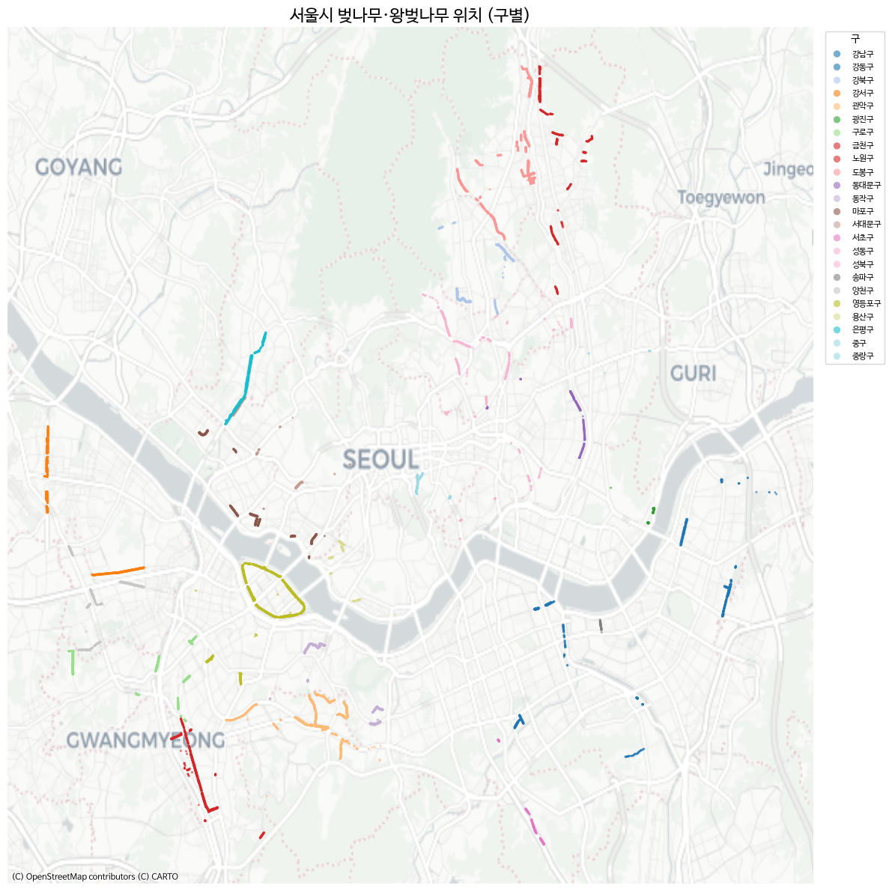
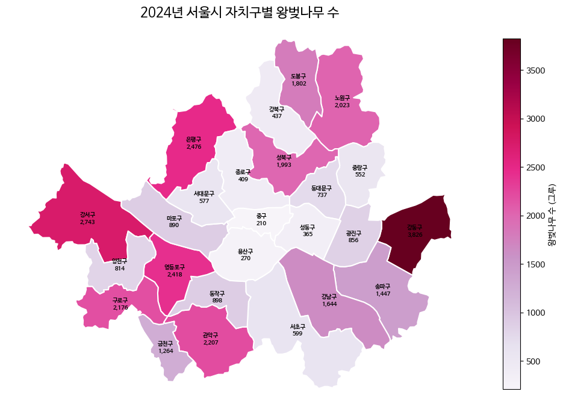
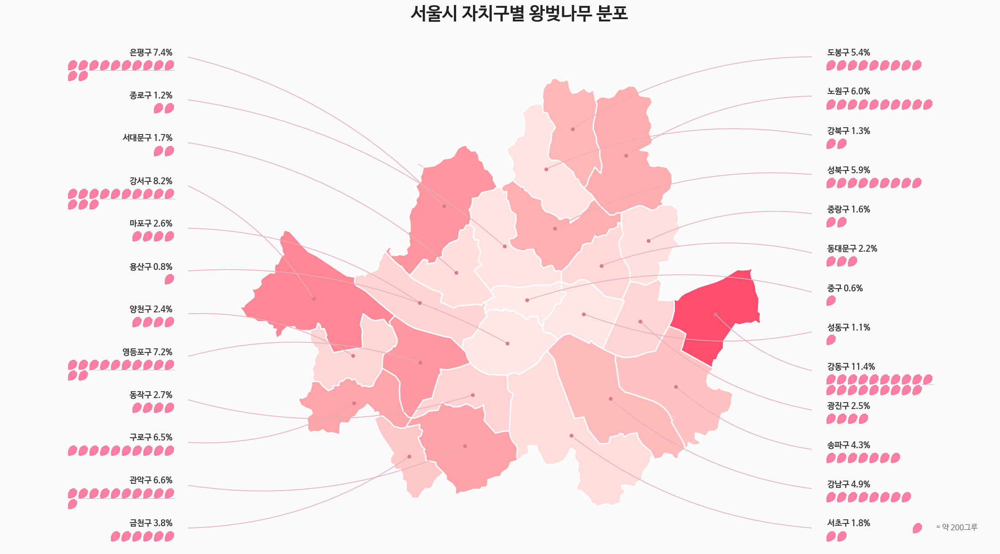
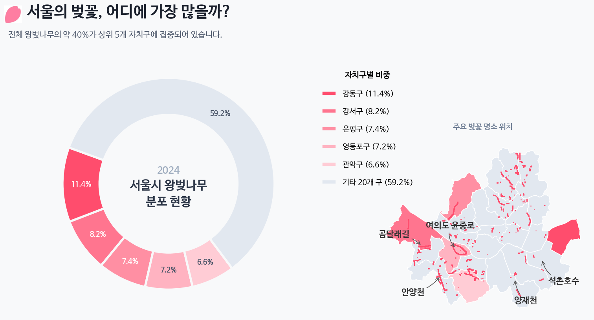

최근 날씨가 따뜻해지면서 벚꽃이 피려고 하고 있다.

한국의 서울은 이 맘때 쯤이면 벚꽃놀이를 하는데, 서울의 벚꽃은 어디에 얼마나 있는지 궁금해졌다.

데이터를 다운받고 탐색적 분석을 해보며 관찰해보자.

[**서울 열린데이터**](https://data.seoul.go.kr/dataList/OA-320/S/1/datasetView.do)에서 가로수 위치 데이터를 받는다. 2023년 기준인거 같아 아쉽지만, 우선 이대로 해보자.


```python
import pandas as pd
df = pd.read_csv("seoul_roadside_trees.csv", low_memory=False)
```


## 가로수 별 총 갯수

```python
tree_counts_series = df["TREE_NM"].value_counts()
tree_freq_series = tree_counts_series / tree_counts_series.sum()
tree_freq_series.name = "freq"
pd.concat([tree_counts_series, tree_freq_series], axis=1).head(10)
```

```
count	freq
TREE_NM		
은행나무	109331	0.425024
양버즘나무	68753	0.267277
느티나무	22928	0.089133
버즘나무	17407	0.067670
벚나무	7195	0.027971
왕벚나무	6623	0.025747
메타세쿼이아	5289	0.020561
회화나무	4655	0.018096
소나무	2740	0.010652
이팝나무	2647	0.010290

```

은행나무는 42.5%으로 역시 가장 많다. 벚나무와 왕벚나무 각각 2.7%, 2.5% 으로 있다.


벚나무만 한정해서 봐보자.
```python
cb_df = df[df["TREE_NM"].isin(["벚나무", "왕벚나무"])]
cb_df["GU_NM"].value_counts().head()
```

```
GU_NM
영등포구    1803
도봉구     1700
관악구     1335
강서구      964
금천구      933
Name: count, dtype: int64
```

영등포구가 가장 많다. 여의도 벚꽃이 역시 많은거 같다. 강서구, 금천구도 벚꽃이 꽤 많다고 생각했는데 TOP5에 들어온다.

지도에 표시해볼까?


<details>
<summary>코드 보기</summary>


```python
import geopandas as gpd
import matplotlib.pyplot as plt
import matplotlib as mpl
import matplotlib.font_manager as fm
import contextily as ctx
from shapely.geometry import Point

# 나눔바른고딕 폰트 설정
fm._load_fontmanager(try_read_cache=False)  # 폰트 캐시 갱신
mpl.rcParams["font.family"] = "NanumBarunGothic"
mpl.rcParams["axes.unicode_minus"] = False

# GeoDataFrame 생성
gdf = gpd.GeoDataFrame(
    cb_df,
    geometry=[Point(float(x), float(y)) for x, y in zip(cb_df["LOT"], cb_df["LAT"])],
    crs="EPSG:4326",
)

# Web Mercator로 변환 (배경지도용)
gdf = gdf.to_crs(epsg=3857)

# 구별 색상 지정
districts = sorted(gdf["GU_NM"].unique())
cmap = plt.cm.get_cmap("tab20", len(districts))
color_map = {gu: cmap(i) for i, gu in enumerate(districts)}

fig, ax = plt.subplots(figsize=(12, 12))

for gu in districts:
    sub = gdf[gdf["GU_NM"] == gu]
    ax.scatter(
        sub.geometry.x, sub.geometry.y,
        c=[color_map[gu]], label=gu,
        s=5, alpha=0.6, edgecolors="none",
    )

# 배경지도 추가
ctx.add_basemap(ax, source=ctx.providers.CartoDB.Positron)

ax.set_title("서울시 벚나무·왕벚나무 위치 (구별)", fontsize=16)
ax.legend(
    loc="upper left", bbox_to_anchor=(1.01, 1),
    markerscale=3, fontsize=8, title="구",
)
ax.set_axis_off()
plt.tight_layout()
plt.show()
```

</details>



- 여의도가 뚜렷하게 보인다.
- 강서구의 곰달래길도 뚜렷하게 보인다.
- 금천구 역시 벚꽃이 유명한것 답게 잘보인다.

그런데 안양천, 석촌호수 등 유명한 벚꽃 명소가 안보인다.
더 찾아보니 [**서울 열린데이터**](https://data.seoul.go.kr/dataList/367/S/2/datasetView.do) 에 구 별로 정리된 데이터는 있다. 좌표 정보는 없다.

`roadside_tree_2026.csv`으로 다운받았다.


<details>
<summary>코드 보기</summary>

```python
df2 = pd.read_csv("roadside_tree_2026.csv", low_memory=False)

species_row = df2.iloc[1].values  # 종별 이름 행
cols = df2.columns.tolist()

# 연도별 시작 컬럼 인덱스 매핑
year_starts = {}
for i, c in enumerate(cols):
    base = c.split(".")[0]
    if base not in year_starts and base not in ["자치구별(1)", "자치구별(2)"]:
        year_starts[base] = i
years = list(year_starts.keys())

# 구 이름 필터 (소계, 기관 제외)
districts = ["종로구", "중구", "용산구", "성동구", "광진구", "동대문구", "중랑구", "성북구",
             "강북구", "도봉구", "노원구", "은평구", "서대문구", "마포구", "양천구", "강서구",
             "구로구", "금천구", "영등포구", "동작구", "관악구", "서초구", "강남구", "송파구", "강동구"]
data_rows = df2[df2["자치구별(2)"].isin(districts)].copy()

# 연도별 벚나무(왕벚나무) 컬럼 추출 → long format
records = []
for yi, y in enumerate(years):
    start = year_starts[y]
    cherry_col_idx = start + 5  # 각 연도 블록 내 offset 5 = 벚나무/왕벚나무
    for _, row in data_rows.iterrows():
        val = row.iloc[cherry_col_idx]
        try:
            val = int(val)
        except (ValueError, TypeError):
            val = 0
        records.append({"year": int(y), "district": row["자치구별(2)"], "cherry_count": val})

cherry_df = pd.DataFrame(records)
cherry_df.head()
```

</details>

```
year	district	cherry_count
0	2004	종로구	145
1	2004	중구	58
2	2004	용산구	166
3	2004	성동구	429
4	2004	광진구	0
```

데이터는 2004년 부터 2024년 까지 있다. 여러 나무가 있으니까 Time-series를 보여주기에도 재밌을거 같다. 


대략 그려보면 아래처럼 나온다.


<details>
<summary>코드 보기</summary>


```python
import geopandas as gpd
import matplotlib.pyplot as plt
import matplotlib as mpl
import matplotlib.font_manager as fm

# 한글 폰트 설정
fm._load_fontmanager(try_read_cache=False)
mpl.rcParams["font.family"] = "NanumBarunGothic"
mpl.rcParams["axes.unicode_minus"] = False

# 서울 자치구 경계
seoul = gpd.read_file("seoul_gu.geojson")

# 2024년 벚나무 수
cherry_2024 = cherry_df[cherry_df["year"] == 2024][["district", "cherry_count"]].copy()

# 병합
seoul = seoul.merge(cherry_2024, left_on="name", right_on="district", how="left")
seoul["cherry_count"] = seoul["cherry_count"].fillna(0).astype(int)

fig, ax = plt.subplots(figsize=(10, 10))

seoul.plot(
    column="cherry_count", cmap="PuRd", edgecolor="white", linewidth=1.5,
    legend=True,
    legend_kwds={"label": "왕벚나무 수 (그루)", "shrink": 0.6},
    ax=ax,
)

# 구 이름 + 그루 수 라벨
for _, row in seoul.iterrows():
    centroid = row.geometry.centroid
    ax.annotate(
        f"{row['name']}\n{row['cherry_count']:,}",
        xy=(centroid.x, centroid.y),
        ha="center", va="center", fontsize=7, fontweight="bold",
    )

ax.set_title("2024년 서울시 자치구별 왕벚나무 수", fontsize=16)
ax.set_axis_off()
plt.tight_layout()
plt.show()
```

</details>



> 강동구는 왜저렇게 많지?


이제 서울시의 구에 따라 벚나무의 전체 크기에서 얼마나 있는지 나타내보자. 벚꽃은 잎이 핑크색으로 이쁘니 이걸 활용해서 그려보자. `Gemini`에게 핑크색 벚꽃잎을 단색으로 그려달라고 한다.


나쁘지 않다. 지도와 함께 TSV 데이터들로 이미지를 만들어보자. AI를 이용하여 인포그래픽을 구상하기 위함이므로, 손으로 그림을 그리고 AI를 활용하는 방식을 진행한다.

<details>
<summary>코드 보기</summary>

```python
import numpy as np
import geopandas as gpd
import matplotlib.pyplot as plt
import matplotlib as mpl
import matplotlib.font_manager as fm
import matplotlib.image as mpimg
from matplotlib.offsetbox import OffsetImage, AnnotationBbox
import matplotlib.colors as mcolors

# 폰트 설정
fm._load_fontmanager(try_read_cache=False)
mpl.rcParams["font.family"] = "NanumBarunGothic"
mpl.rcParams["axes.unicode_minus"] = False

# === 데이터 준비 ===
seoul_inf = gpd.read_file("seoul_gu.geojson")
# (참고: cherry_df는 기존에 로드된 데이터프레임을 사용한다고 가정합니다)
c2024 = cherry_df[cherry_df["year"] == 2024][["district", "cherry_count"]].copy()
seoul_inf = seoul_inf.merge(c2024, left_on="name", right_on="district", how="left")
seoul_inf["cherry_count"] = seoul_inf["cherry_count"].fillna(0).astype(int)
total = seoul_inf["cherry_count"].sum()
seoul_inf["pct"] = seoul_inf["cherry_count"] / total * 100
seoul_inf["n_petals"] = np.maximum(1, seoul_inf["cherry_count"] // 200)

seoul_inf["cx"] = seoul_inf.geometry.centroid.x
seoul_inf["cy"] = seoul_inf.geometry.centroid.y
mcx = seoul_inf["cx"].mean()

# 좌우 분할 및 Y축 정렬
left_mask = seoul_inf["cx"] < mcx
left_df = seoul_inf[left_mask].sort_values("cy", ascending=False).reset_index(drop=True)
right_df = seoul_inf[~left_mask].sort_values("cy", ascending=False).reset_index(drop=True)

# === 벚꽃잎 이미지 함수 ===
petal_img = mpimg.imread(
    "/home/jonghwan/git/jonghwanyoon.github.io/src/content/blog/30daychartchallenge/day1-part-to-whole/cherry-blossom.png"
)

def make_petal_grid(img, count, cols=10):
    count = max(1, count)
    n_rows = int(np.ceil(count / cols))
    h, w = img.shape[:2]
    grid = np.zeros((n_rows * h, min(count, cols) * w, 4))
    for i in range(count):
        r, c = divmod(i, cols)
        grid[r * h:(r + 1) * h, c * w:(c + 1) * w] = img[:, :, :4]
    return grid

# === 그리기 ===
fig, ax = plt.subplots(figsize=(22, 16))
fig.patch.set_facecolor("#fafafa")
ax.set_facecolor("#fafafa")

# 1. 코로플레스 지도 그리기
cmap = mcolors.LinearSegmentedColormap.from_list("cherry_grad", ["#fff0f0", "#ffb3b3", "#ff4d6d"])
seoul_inf.plot(
    ax=ax, 
    column="pct", 
    cmap=cmap, 
    edgecolor="white", 
    linewidth=2, 
    zorder=2,
    vmin=0,
    vmax=seoul_inf["pct"].max()
)

bounds = seoul_inf.geometry.total_bounds
map_w = bounds[2] - bounds[0]
map_h = bounds[3] - bounds[1]

left_x = bounds[0] - (map_w * 0.1)
right_x = bounds[2] + (map_w * 0.1)
y_start = bounds[3] + (map_h * 0.05)
y_end = bounds[1] - (map_h * 0.05)
left_y_coords = np.linspace(y_start, y_end, len(left_df))
right_y_coords = np.linspace(y_start, y_end, len(right_df))

# 2. 왼쪽 라벨 그리기
for i, row in left_df.iterrows():
    cx, cy = row["cx"], row["cy"]
    lx, ly = left_x, left_y_coords[i]
    
    # 곡선 지시선
    rad = 0.15 if cy > ly else -0.15
    ax.annotate("", xy=(cx, cy), xytext=(lx, ly),
                arrowprops=dict(arrowstyle="-", color="#e8aeb7", connectionstyle=f"arc3,rad={rad}", lw=1.2), zorder=3)
    ax.plot(cx, cy, "o", color="#d67c8b", markersize=5, zorder=4)
    
    # [수정됨] 텍스트: va="bottom"으로 설정하여 선(ly) 위로 글씨를 올림
    ax.text(lx - 0.01, ly, f"{row['name']} {row['pct']:.1f}% ", fontsize=13, ha="right", va="bottom", fontweight="bold", color="#333", zorder=5)
    
    # [수정됨] 벚꽃잎: xybox로 5포인트 정도 아래로 더 내려서 여백 확보
    grid = make_petal_grid(petal_img, row["n_petals"], cols=10)
    im = OffsetImage(grid, zoom=0.08)
    ab = AnnotationBbox(im, (lx - 0.01, ly), frameon=False, box_alignment=(1.0, 1.0), xybox=(0, -5), boxcoords="offset points", zorder=4)
    ax.add_artist(ab)

# 3. 오른쪽 라벨 그리기
for i, row in right_df.iterrows():
    cx, cy = row["cx"], row["cy"]
    lx, ly = right_x, right_y_coords[i]
    
    # 곡선 지시선
    rad = -0.15 if cy > ly else 0.15
    ax.annotate("", xy=(cx, cy), xytext=(lx, ly),
                arrowprops=dict(arrowstyle="-", color="#e8aeb7", connectionstyle=f"arc3,rad={rad}", lw=1.2), zorder=3)
    ax.plot(cx, cy, "o", color="#d67c8b", markersize=5, zorder=4)
    
    # [수정됨] 텍스트: va="bottom"으로 설정하여 선(ly) 위로 글씨를 올림
    ax.text(lx + 0.01, ly, f" {row['name']} {row['pct']:.1f}%", fontsize=13, ha="left", va="bottom", fontweight="bold", color="#333", zorder=5)
    
    # [수정됨] 벚꽃잎: xybox로 5포인트 정도 아래로 더 내려서 여백 확보
    grid = make_petal_grid(petal_img, row["n_petals"], cols=10)
    im = OffsetImage(grid, zoom=0.08)
    ab = AnnotationBbox(im, (lx + 0.01, ly), frameon=False, box_alignment=(0.0, 1.0), xybox=(0, -5), boxcoords="offset points", zorder=4)
    ax.add_artist(ab)

# === 축 및 범례 마무리 ===
pad_x, pad_y = map_w * 0.45, map_h * 0.1
ax.set_xlim(bounds[0] - pad_x, bounds[2] + pad_x)
ax.set_ylim(bounds[1] - pad_y, bounds[3] + pad_y)
ax.set_axis_off()

# 제목
ax.text(mcx, bounds[3] + map_h * 0.15, "서울시 자치구별 왕벚나무 분포", 
        fontsize=28, fontweight="bold", ha="center", va="center", color="#222")

# 범례
legend_petal = OffsetImage(petal_img, zoom=0.08)
legend_x = bounds[2] + (map_w * 0.3)
legend_y = bounds[1] - (map_h * 0.05)
ab_leg = AnnotationBbox(legend_petal, (legend_x, legend_y), frameon=False, zorder=5)
ax.add_artist(ab_leg)
ax.text(legend_x + 0.015, legend_y, "= 약 200그루", fontsize=12, va="center", color="#666")

plt.tight_layout()
plt.show()
```

</details>




이렇게 표현하니.. `part-to-whole`이랑 아주 맞는지는 모르겠다. 


<details>
<summary>코드 보기</summary>

```python
import pandas as pd
import geopandas as gpd
import matplotlib.pyplot as plt
import matplotlib as mpl
import matplotlib.font_manager as fm
import os

# 폰트 설정
fm._load_fontmanager(try_read_cache=False)
mpl.rcParams["font.family"] = "NanumBarunGothic"
mpl.rcParams["axes.unicode_minus"] = False

# 손글씨 폰트 설정
handwriting_fp = fm.FontProperties(family='NanumBarunGothic', size=16, weight='bold')

# === 1. 데이터 준비 ===
data = {
    'district': ['강동구', '강서구', '은평구', '영등포구', '관악구', '기타 20개 구'],
    'pct': [11.4, 8.2, 7.4, 7.2, 6.6, 59.2] 
}
df = pd.DataFrame(data)

# === 2. 지도 데이터 및 색상 매핑 ===
seoul_inf = gpd.read_file("seoul_gu.geojson")
bg_color = "#F8F9FA"
colors = ["#FF4D6D", "#FF758F", "#FF8FA3", "#FFB3C1", "#FFCCD5", "#E2E8F0"]

color_map = {row['district']: colors[i] for i, row in df.iloc[:5].iterrows()}
seoul_inf['color'] = seoul_inf['name'].map(color_map).fillna(colors[5])

# === 3. 캔버스 및 레이아웃 ===
fig = plt.figure(figsize=(16, 9), facecolor=bg_color)

ax_main = fig.add_axes([0.02, 0.05, 0.55, 0.75]) 
ax_map = fig.add_axes([0.62, 0.05, 0.35, 0.5])   

ax_main.set_facecolor(bg_color)
ax_map.set_facecolor(bg_color)

# === 4. 메인 타이틀 ===
fig.text(0.05, 0.90, "서울의 벚꽃, 어디에 가장 많을까?", fontsize=28, fontweight='bold', color='#1A202C')
fig.text(0.05, 0.84, "전체 왕벚나무의 약 40%가 상위 5개 자치구에 집중되어 있습니다.", fontsize=15, color='#4A5568')

# === 5. 도넛 차트 ===
wedges, texts, autotexts = ax_main.pie(
    df['pct'], colors=colors, autopct='%1.1f%%', startangle=160, pctdistance=0.82,
    wedgeprops=dict(width=0.35, edgecolor=bg_color, linewidth=4),
    textprops=dict(fontsize=13, fontweight='bold')
)

for i, autotext in enumerate(autotexts):
    autotext.set_color('white' if i < 3 else '#4A5568')

ax_main.text(0, 0.12, "2024", ha='center', va='center', fontsize=18, fontweight='bold', color='#A0AEC0')
ax_main.text(0, -0.1, "서울시 왕벚나무\n분포 현황", ha='center', va='center', fontsize=22, fontweight='bold', color='#2D3748', linespacing=1.4)

# === 6. 범례 ===
legend_labels = [f"{row['district']} ({row['pct']:.1f}%)" for _, row in df.iterrows()]
ax_main.legend(wedges, legend_labels, title="자치구별 비중", title_fontproperties={'weight':'bold', 'size':15},
          loc="upper left", bbox_to_anchor=(1.05, 0.95), frameon=False, fontsize=14, labelspacing=1.3)

# === 7. 미니맵 그리기 ===
seoul_inf.plot(ax=ax_map, color=seoul_inf['color'], edgecolor="white", linewidth=1.2, zorder=1)
ax_map.set_axis_off()

# 💡 사용자분의 멋진 실제 나무 데이터 오버레이 (주석 해제해서 사용하세요)
gdf_real = gpd.GeoDataFrame(cb_df, geometry=gpd.points_from_xy(cb_df.LOT, cb_df.LAT), crs="EPSG:4326")
gdf_real.plot(ax=ax_map, color='#FF4D6D', markersize=1, alpha=0.6, zorder=2)


# === 8. 주요 벚꽃 명소 손글씨 라벨링 (좌표 정밀 수정) ===
spots = [
    {'name': '곰달래길', 'coords': (126.845, 37.532), 'xytext': (-50, 20), 'rad': -0.2},
    # 안양천: 영등포 경계보다 약간 아래 양천/구로 라인으로 수정
    {'name': '안양천', 'coords': (126.885, 37.480), 'xytext': (-50, -30), 'rad': 0.2},
    {'name': '여의도 윤중로', 'coords': (126.918, 37.528), 'xytext': (-10, 40), 'rad': 0.3},
    {'name': '석촌호수', 'coords': (127.103, 37.508), 'xytext': (40, -40), 'rad': -0.3},
    # 양재천: 강남 하단 라인으로 위로 살짝 올림
    {'name': '양재천', 'coords': (127.045, 37.475), 'xytext': (20, -40), 'rad': -0.2}
]

for spot in spots:
    cx, cy = spot['coords']
    ax_map.annotate(
        spot['name'],
        xy=(cx, cy),
        xytext=spot['xytext'],
        textcoords='offset points',
        ha='center', va='center',
        fontproperties=handwriting_fp, 
        color='#333333',
        zorder=5, # 글씨가 지도나 점 밑으로 숨지 않게 최상단 배치
        arrowprops=dict(
            arrowstyle="->",
            color="#555555",
            lw=1.2,
            connectionstyle=f"arc3,rad={spot['rad']}"
        )
    )

ax_map.text(0.5, 1.05, "주요 벚꽃 명소 위치", transform=ax_map.transAxes, ha='center', va='bottom', fontsize=14, fontweight='bold', color='#718096')

plt.show()
```

</details>




- 손으로 그리고 지도를 얹어서, 뭔가 그려보려니 잘 안된다. 
- 생각보다 창의력이 매우 많이 필요하다. AI를 사용해도 어려운거 같다. 어려운데 재미있다.
