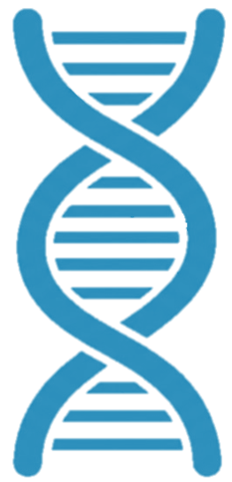
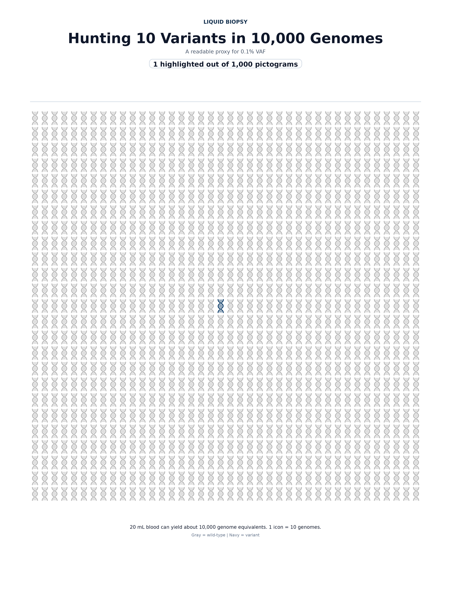

This time... let's draw with DNA.

Since the theme is pictogram, I first asked GEMINI to generate a DNA pictogram image.

Then I removed the background in PowerPoint.

Keeping it simple: if 10 mL of blood contains a total of 30 ng of DNA, and 1 ng corresponds to 303 haploid genomes, then `303 * 30 = 9,090`, which is roughly 10,000 haploid genomes.

Liquid biopsy in cancer genomics is all about finding a tiny amount of ctDNA, so I wanted to make something that feels like searching for 1 out of 10,000.

- Showing all 10,000 made it too hard to spot, so I went with 1,000 instead.
- Still, this one feels a bit lacking.
- I came up with a project idea while working on this. I should probably try that from the next round on.
